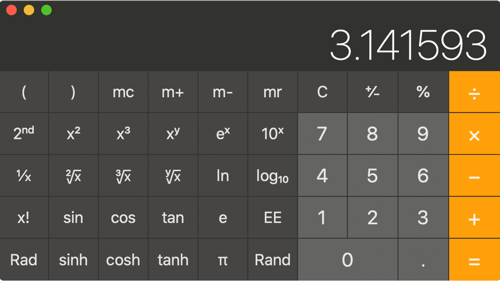

# Calculator with saving operations Operation

⭐ Implement a calculator using Laravel, React and MongoDB:

##### Stack:

- implement a calculator using ReactJS and Laravel (follow the attached design).
- The calculator will save the history of the user in a MongoDB database.
- Think how are you going to save all the operations / operands in the database.
- Sometimes equations get complicated.

### Design

